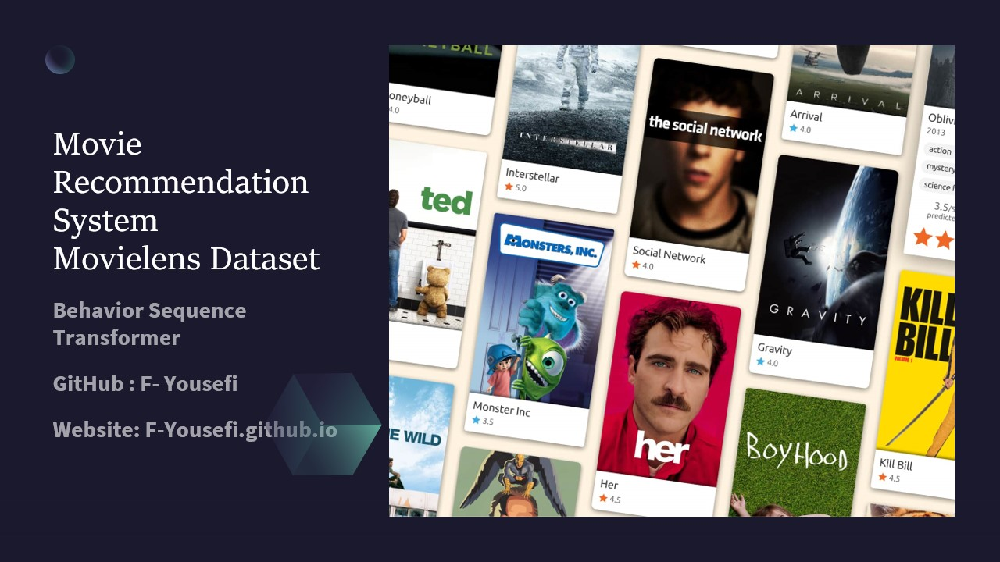
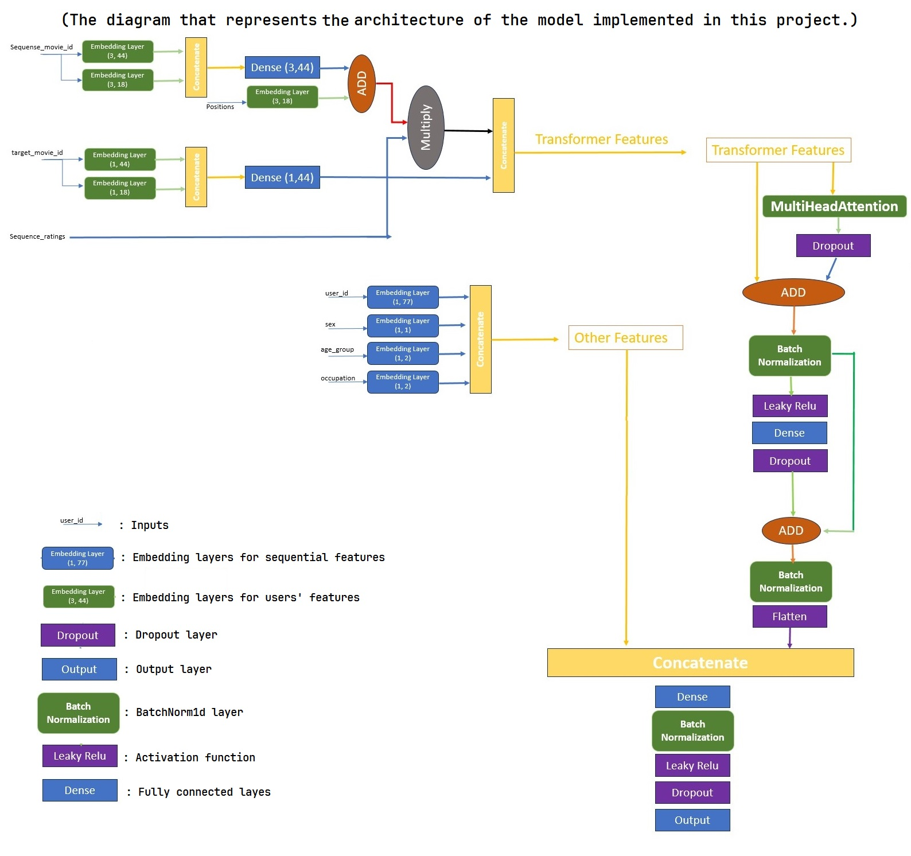
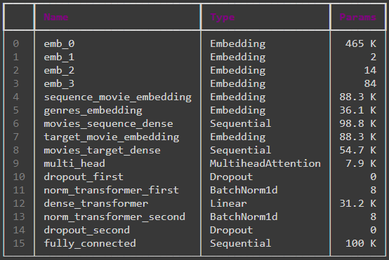

MovieLens.org | Bob Liu

# Movie Recommendation System
### **_Behavior Sequence Transformer- Pytorch_**
---------------
## Abstrsct
Recommendation systems play an essential role in our lives; however they are almost ignored academically. In this project, I will create a movie recommendation system model based on Movielens dataset. The neat idea behind this project is inspired by the paper `Behavior Sequence Transformer for E-commerce Recommendation in Alibaba` that can be found through this [link](https://arxiv.org/abs/1905.06874). In mentioned article, the author explains why this model and architecture responds better than any other RecSys before it. This architecture uses the feature that almost all the other RecSys ignored, the behavior sequence of each user over a period of time. For example, in our case, when a user has never seen a horror movie, definitely "The Silence of Lambs" is not the movie that a good RecSys recommends to him/her. Additionally, a user might decide to see movies of other genres too. For example, after watching hundreds of drama movies, he/she decided to watch comedy movies, in this case all the previous generation of RecSys might fail to understand the pattern, but not this one.

## Dataset
#### Movielens
GroupLens Research has collected and made available rating data sets from the MovieLens web site [https://movielens.org](https://movielens.org). The data sets were collected over various periods of time, depending on the size of the set. We have chosen the dataset with one million records for this project. MovieLens 1M consists 1 million ratings from 6000 users on 4000 movies.

#### Download
The dataset will be automatically downloaded as you run the main .ipynb file.

## Architecture 
#### Papers
This project is implemented based on two breakthrough papers [Behavior Sequence Transformer for E-commerce Recommendation in Alibaba](https://arxiv.org/abs/1905.06874) and [Attention is all you need](https://arxiv.org/abs/1706.03762). For more information and acquiring a better understanding of the project, you can consult these papers.

#### Graphical Architecture
As you can see, the diagram below is representing the whole architecture of the model used in this project.
> Left Graph : Graphical Architecture

> Right Table: All the layers of the model

 

  
  

